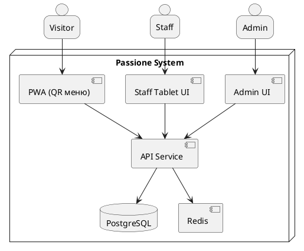
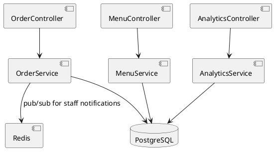

# C4 Model (Passione)

### C4 Context


<details><summary>PlantUML source</summary>

```plantuml
@startuml
skinparam shadowing false
skinparam backgroundColor white
skinparam DefaultFontSize 14

' C1: Context
actor "Visitor" as U
actor "Staff" as St
actor "Admin" as Ad

system "Passione System" as Sys

U --> Sys : QR-меню, заказ
St --> Sys : приём/статусы
Ad --> Sys : админка/аналитика
@enduml

```

</details>

### C4 Container


<details><summary>PlantUML source</summary>



</details>

### C4 Component


<details><summary>PlantUML source</summary>



</details>

