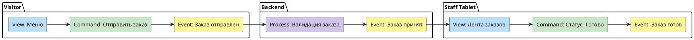

# Event Modeling (Passione)

### Event Modeling

PlantUML source

```plantuml
@startuml
skinparam shadowing false
skinparam backgroundColor white
skinparam DefaultFontSize 14

left to right direction
package "Visitor" {
  rectangle "View: Меню" #BBDEFB
  rectangle "Command: Отправить заказ" #C8E6C9
  rectangle "Event: Заказ отправлен" #FFF59D
}
package "Backend" {
  rectangle "Process: Валидация заказа" #D1C4E9
  rectangle "Event: Заказ принят" #FFF59D
}
package "Staff Tablet" {
  rectangle "View: Лента заказов" #BBDEFB
  rectangle "Command: Статус=Готово" #C8E6C9
  rectangle "Event: Заказ готов" #FFF59D
}

"View: Меню" --> "Command: Отправить заказ"
"Command: Отправить заказ" --> "Event: Заказ отправлен"
"Event: Заказ отправлен" --> "Process: Валидация заказа"
"Process: Валидация заказа" --> "Event: Заказ принят"
"Event: Заказ принят" --> "View: Лента заказов"
"View: Лента заказов" --> "Command: Статус=Готово"
"Command: Статус=Готово" --> "Event: Заказ готов"
@enduml

```

