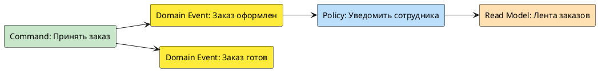
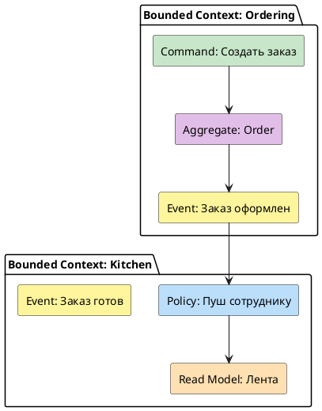

# EventStorming (Passione)

### Es Big Picture

PlantUML source

```plantuml
@startuml
skinparam shadowing false
skinparam backgroundColor white
skinparam DefaultFontSize 14

left to right direction
skinparam rectangle {
  BorderColor black
  BackgroundColor #fff
}
rectangle "Domain Event: Заказ оформлен" #ffeb3b
rectangle "Policy: Уведомить сотрудника" #bbdefb
rectangle "Command: Принять заказ" #c8e6c9
rectangle "Read Model: Лента заказов" #ffe0b2
rectangle "Domain Event: Заказ готов" #ffeb3b

"Command: Принять заказ" -down-> "Domain Event: Заказ оформлен"
"Domain Event: Заказ оформлен" -down-> "Policy: Уведомить сотрудника"
"Policy: Уведомить сотрудника" -down-> "Read Model: Лента заказов"
"Command: Принять заказ" -down-> "Domain Event: Заказ готов"
@enduml

```

### Es Process

PlantUML source

```plantuml
@startuml
skinparam shadowing false
skinparam backgroundColor white
skinparam DefaultFontSize 14

left to right direction
rectangle "Event: QR-меню открыто" #FFF59D
rectangle "Event: Блюдо добавлено" #FFF59D
rectangle "Event: Комментарий добавлен" #FFF59D
rectangle "Event: Заказ отправлен" #FFF59D
rectangle "Event: Заказ принят" #FFF59D
rectangle "Event: Заказ готов" #FFF59D

rectangle "Command: Отправить заказ" #C8E6C9
rectangle "Command: Принять заказ" #C8E6C9
rectangle "Command: Обновить статус" #C8E6C9

"Event: QR-меню открыто" --> "Event: Блюдо добавлено"
"Event: Блюдо добавлено" --> "Event: Комментарий добавлен"
"Event: Комментарий добавлен" --> "Command: Отправить заказ"
"Command: Отправить заказ" --> "Event: Заказ отправлен"
"Event: Заказ отправлен" --> "Command: Принять заказ"
"Command: Принять заказ" --> "Event: Заказ принят"
"Event: Заказ принят" --> "Command: Обновить статус"
"Command: Обновить статус" --> "Event: Заказ готов"
@enduml

```

### Es Design

PlantUML source

```plantuml
@startuml
skinparam shadowing false
skinparam backgroundColor white
skinparam DefaultFontSize 14

package "Bounded Context: Ordering" {
  rectangle "Aggregate: Order" #E1BEE7
  rectangle "Command: Создать заказ" #C8E6C9
  rectangle "Event: Заказ оформлен" #FFF59D
}
package "Bounded Context: Kitchen" {
  rectangle "Policy: Пуш сотруднику" #BBDEFB
  rectangle "Read Model: Лента" #FFE0B2
  rectangle "Event: Заказ готов" #FFF59D
}
"Command: Создать заказ" -down-> "Aggregate: Order"
"Aggregate: Order" -down-> "Event: Заказ оформлен"
"Event: Заказ оформлен" -down-> "Policy: Пуш сотруднику"
"Policy: Пуш сотруднику" -down-> "Read Model: Лента"
@enduml

```

