# Passione — Спецификация (Lab 3)

### Usecase

PlantUML source

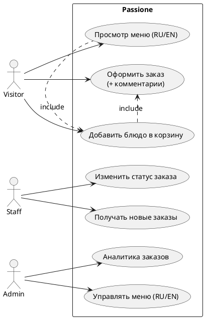

### Activity Order

PlantUML source

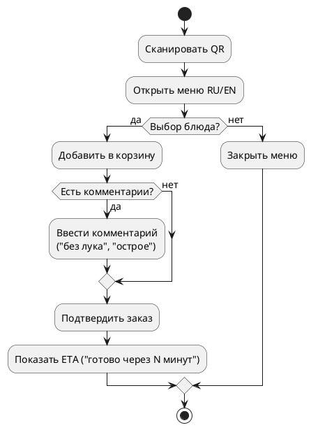

### Activity Staff

PlantUML source

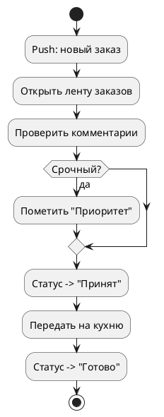

### Class Core

PlantUML source

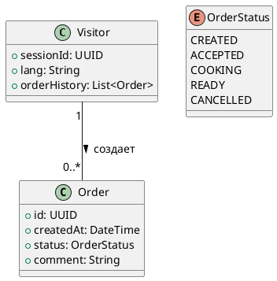

### Class Menu

PlantUML source

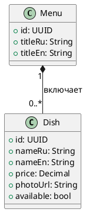

### Class Comment

PlantUML source

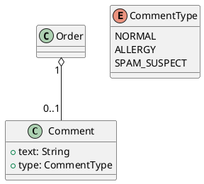

### Class Staff

PlantUML source

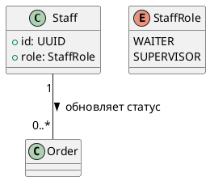

### Class Admin

PlantUML source

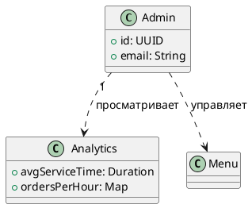

### Seq Scan Order

PlantUML source

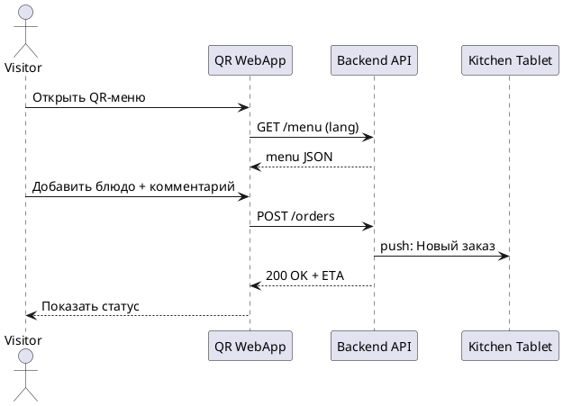

### Seq Repeat

PlantUML source

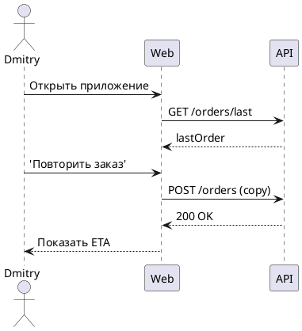

### Seq Staff Flow

PlantUML source

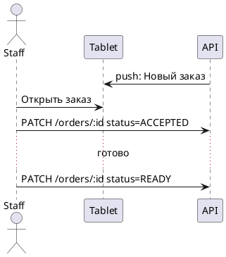

### Seq Admin Menu

PlantUML source

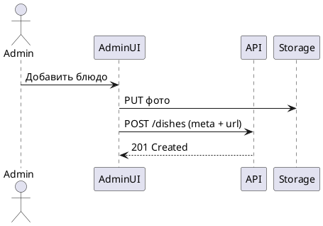

### Seq Error Offline

PlantUML source

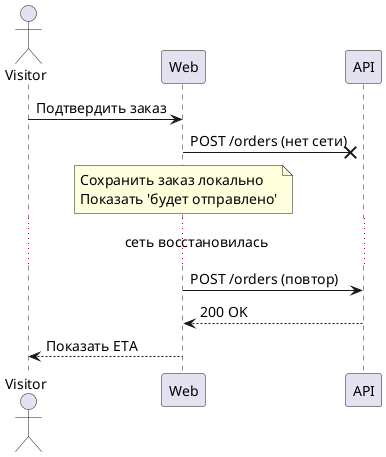

### Components

PlantUML source

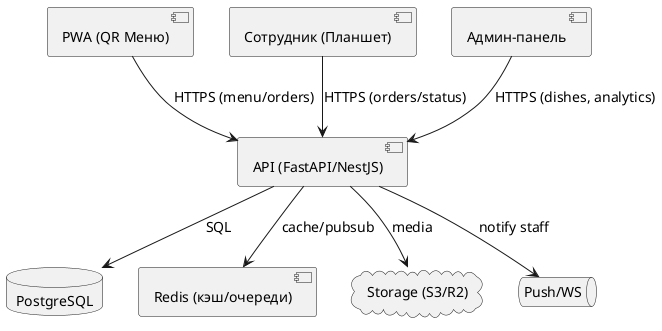

### Packages

PlantUML source

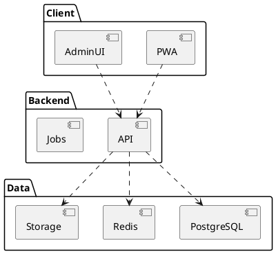

### Deployment

PlantUML source

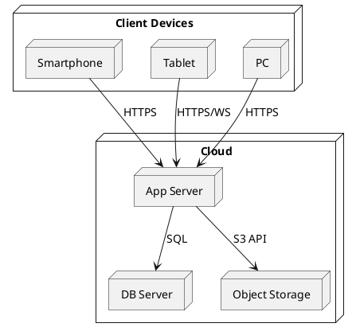

### Erd

PlantUML source

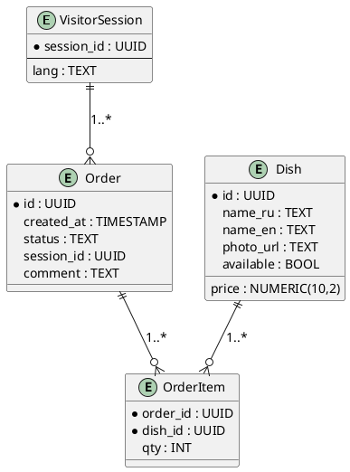

### Orm

PlantUML source

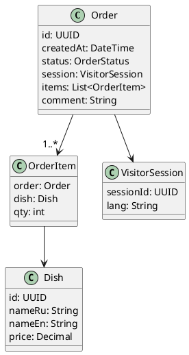

## Сценарии для диаграммы вариантов использования

### Сценарий A: «Кастомизация десерта»
1) Гость сканирует QR, открывает **Меню (RU/EN)**.  
2) Выбирает блюдо, нажимает **Добавить в корзину**.  
3) Вводит комментарий: _«без лука, соус отдельно»_.  
4) Подтверждает заказ, получает ETA.  
5) Если пропала сеть — заказ сохраняется локально и отправляется при восстановлении.

### Сценарий B: «Повторить предыдущий»
1) Гость открывает приложение и видит кнопку **Повторить прошлый заказ**.  
2) Система подтягивает состав последнего заказа и создаёт новый.  
3) Гость подтверждает. Система показывает ETA.

### Сценарий C: «Работа сотрудника в час-пик»
1) На планшет падает push «Новый заказ».  
2) Сотрудник открывает карточку, видит метки аллергенов/комментарий.  
3) Ставит **Принят** → **Готово**.  
4) Приоритетные заказы помечаются цветом.

### Сценарий D: «Редактирование меню администратором»
1) Администратор загружает фото блюда, сохраняет карточку RU/EN.  
2) Цена и доступность обновляются, изменения сразу видны в QR-меню.

### Сценарий E: «Отчёт Product Owner»
1) Открывает раздел аналитики, сравнивает время обслуживания «до/после».  
2) Экспортирует CSV/PDF для презентации.
